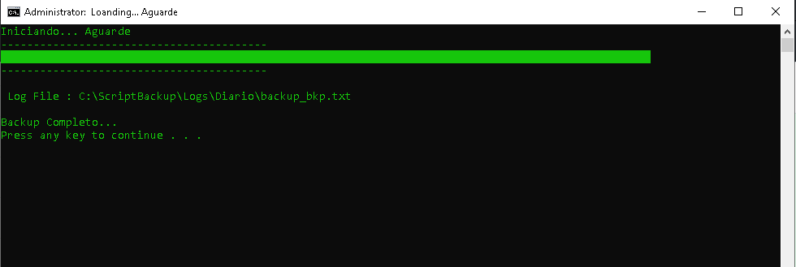
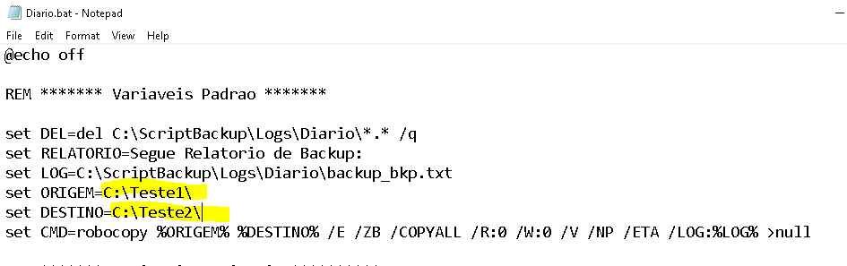

# ScriptBackupRobocopy

1. Coloque a estrutura de pasta do ScriptBackup no HD como mostra a figura abaixo.
2. Abre o CMD (Promp de Comando) no Windows e entre na pasta C:\ScripBackup, e execute o arquivo Diario.bat:
3. Apos executar o Script 'Diario.bat' a seguite mensagem abaixo será mostrada com o progresso do Backup.
4. Antes de executar os passos mencionando acima configura a pasta de ORIGEM e DESTINO no Script 'C:\ScripBackup\Diario.bat'.
5. Relatorio do Backup para Analise está localizado em 'C:\ScriptBackup\Logs\Diario\backup_bkp.txt'.

# Passo a Passo:

1. Coloque a estrutura de pasta do ScriptBackup no HD como mostra a figura abaixo.

2. Abre o CMD (Promp de Comando) no Windows e entre na pasta C:\ScripBackup, e execute o arquivo Diario.bat:

3. Apos executar o Script 'Diario.bat' a seguite mensagem abaixo será mostrada com o progresso do Backup.

4. Antes de executar os passos mencionando acima configura a pasta de ORIGEM e DESTINO no Script 'C:\ScripBackup\Diario.bat'.
- 

5. Relatorio do Backup para Analise está localizado em 'C:\ScriptBackup\Logs\Diario\backup_bkp.txt'.

